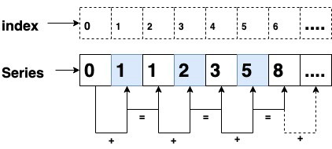
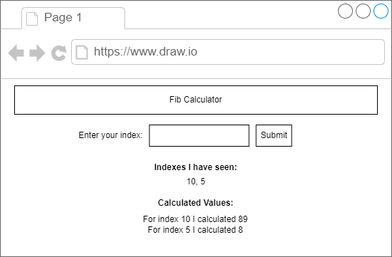
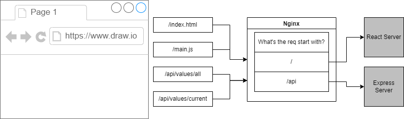
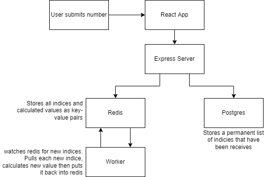
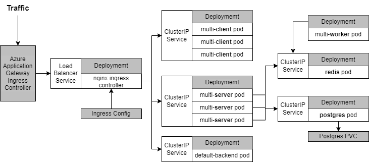
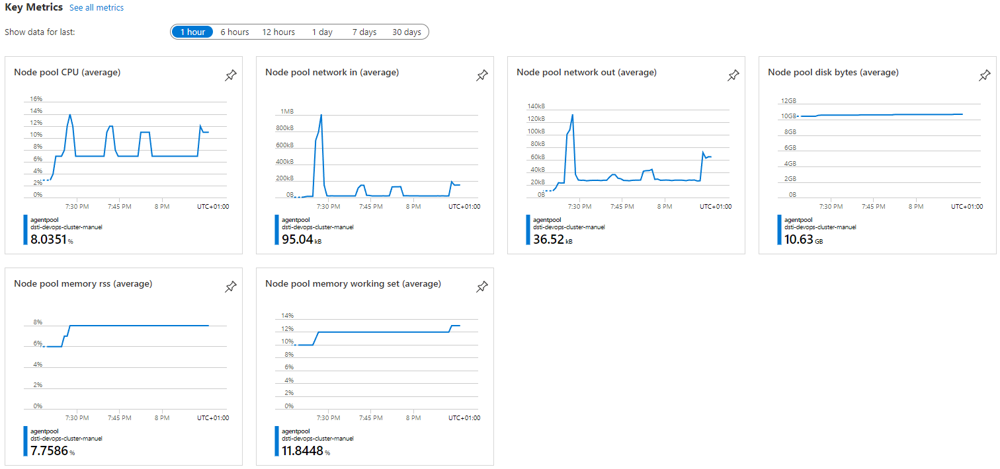

# DSTI-DevOps-Project
Project Repository for S21 DevOps Assignment

Application available at: https://dsti-devops.gawert.de

Demo: https://drive.google.com/file/d/1Y2Qcv_NehTqQa65SHtrvmQ5cDAjafP0x/view?usp=sharing

-> please mailto:manuel.gawert@edu.dsti.institute to start the application (not runnung permanently because of limited Azure Student Credits)

## Project Description

The Project provides a Fibonacci Calculator that uses a multi-container deployment hosted on Microsoft Azure Kubernetes Service.
In the Fibonacci Calculator, the user will enter an Index, and the calculator will provide the correct value. 
Also the interface will display the users last entered values.

To Recall the fibonacci sequence, please see the following picture. A value is always the addition of the two previous values.

This is a mockup of the final interface: 

## The (local) Core Application
- each of the components are containerized
- Once the user visits the application in the browser, it will be going to an Nginx Webserver
- Nginx will route between a react application with all the front-end assets and an Express Server that functions as an API e.g. when a user submits a value in the browser

- In fact, two instances of Nginx should be used: one only responsible for the routing and one that is tight to the React App and will serve its files on Port 3000
- The "Values I have seen" will be stored in a postgres database as they are more permanent
- The Calculated Values will be stored in a Redis Database (Key/Value Pairs)
- The worker is a node.js process which looks for new values in Redis, calculates the value and puts it back to Redis
See the full backend flow here:

## Kubernetes Architecture
- Going to Porduction and Kubernetes, I will not use the Nginx Routing instance, but instead rely on an Ingress Service that routes to the different ClusterIPs
- I am using 5 different deployments with 1 to 3 Replicas and a ClusterIP added to the deployments (except the worker deployment as it doesnt need to be accessed)
- For Postgres I am additionally using a Postgres PVC
- For the conenction from the Server deployment to redis as well as to Postgres is done by storing environment variables about the ports, hosts and users
- The Password for Postgres is stored in a Kubernetes Secret that was created by the automated deployment

(Remark: Eventaully, the Azure Native Loadbalancer is not used as it was very expensive. Traffic is routed directly to the Ingress Controller)

### Kubernetes Setup
- For the initial Kubernetes setup, a Microsoft ARM Template was used https://github.com/Azure/azure-quickstart-templates/tree/master/quickstarts/microsoft.kubernetes/aks
- Due to Quota Limit in the Azure Students subscription, only 1 node cluster could be deployed of size Standard_D4s_v3
- Application is deployed with GitHub Actions Pipeline (see next chapter)
- A Nginx Ingress Controller was deployed as part of the Pipeline https://kubernetes.github.io/ingress-nginx/, which also adds a default backend pod
- Infrastructure Monitoring is activated with Azure Monitor
- For Secure Communication over HTTPS, I installed Cert-Manager using Helm from the jetstack Helm Repository
	https://cert-manager.io/docs/installation/kubernetes/#installing-with-helm
- The Certificate issued by Let's Encrypt, will be stored as a secret in the Kubernetes Cluster

## Prod Deployment
- For the Prod Deployment I am using GitHub Actions as a CI Tool
- As the hosting platform, I am using the Microsoft Azure Kubernetes Serveice (AKS)
- The main deployment pipeline is described in the workflow.yaml which essentially provides all the different build and deployment steps needed
- The containers will be hosted in a private Azure Container Registry (ACR), access is granted via a Service Principal

### GitHub Action
- I created a Service Principal for GitHub in azure with the following command: 
	az ad sp create-for-rbac --name "GitHubSP" --role contributor --scopes /subscriptions/0bef94e0-e086-44d4-9dc7-be9a1cf2c728/resourceGroups/DSTI-DevOps-Project --sdk-auth
- The Service Principal was added to Github Secrets for Access to Azure
- The Postgres Password is stored as a Github Secret and then via the Deployment created as a Secret in Kubernetes
- The SP has pull and push permissions for the ACR
- Also, I added the Username and Password of ACR Service Principal as Github Secrets

## Evaluation Comments
1. web application was created
2. CI/CD Pipeline with GitHub Actions in place as the main mean of provisioning
3. IaC Approach was used during kubernetes environment creation (Azure Resource Manager Bicep Templates)
4. Docker Images are build during deployment and pushed to Azure Container Registry
5. Docker-Compose files are created to demonstrate ability, however they are not used in the pipeline and final Deployment
6. Kubernetes is used for Orchestration of containers
7. Service Mesh architecture used with Cluster IPs and a Nginx for Communication, however no ServiceMesh "Product" like Istio used
8. Monitoring is implemented in a Azure native way using Azure Monitor. 
	- However, Grafana and Prometheus capabilities were demonstrated in another DSTI project, please visit https://clicklearn.gawert.de/d/rYdddlPWk/buoy-hardware-monitoring?orgId=1&refresh=5m&from=1639399041358&to=1639485441358
	- username: viewer
	- password: godsti2021

	

9. Documentation mainly done as part of this README but also within the code
	- nothing else needed for installation, as the applciation is available on the web: https://dsti-devops.gawert.de
	- However, please contact mailto:manuel,gawert@edu.dsti.institute to start the application before grading (cluster is not running permanently because of limited Azure Student Credits)

### Bonus Tasks:
- additionally to JavaScript, React was used for the Frontend
- different Hosting platform (Microsoft Azure) was used
- Kubernetes Secrets used for Service Principal and Postgres Password
- Additional Azure Kubernetes GitHub Action Modules used (https://github.com/Azure/k8s-create-secret,https://github.com/Azure/k8s-deploy, https://github.com/Azure/k8s-set-context)
- Pipeline Resiliency for any tasks was added e.g. by doing --dry-run -o yaml and pipe this to kubectl apply STDIN. This prevents the pipeline to break if artifacts already exist
- Installed cert-manager using Helm and made the application available udner my own domain