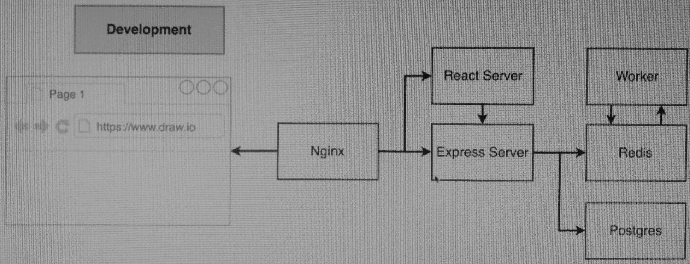
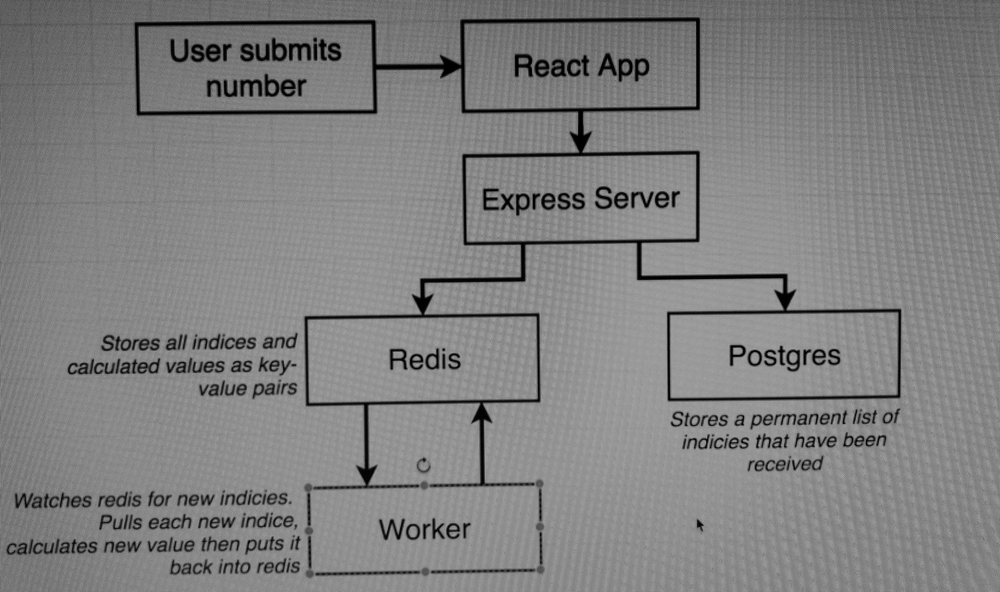
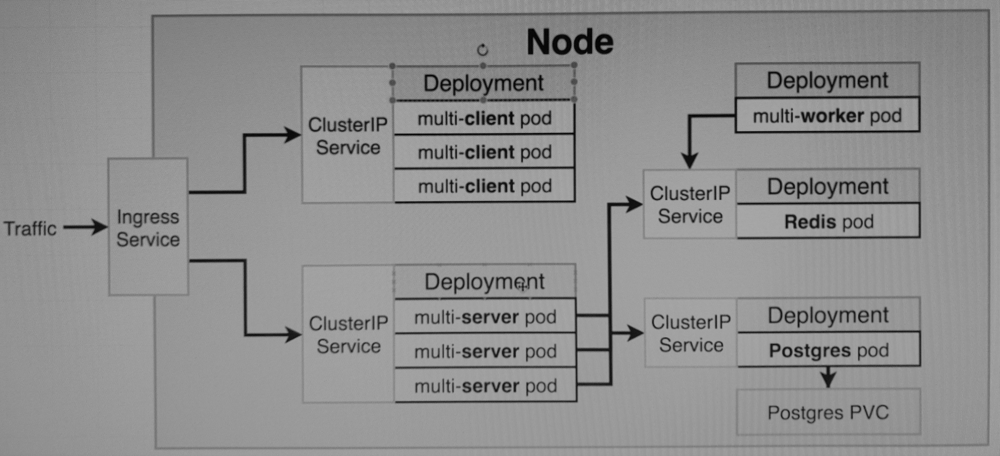

# dsti-devops-project
Project Ropository for S21 DevOps Assignment

## Project Description

The Project provides a Fibonacci Calculator that uses a multi-container deployment hosted on Google Cloud Kubernetes Engine.
In the Fibonacci Calculator, the user will enter an Index, and the calculator will provide the correct value. 
Also the interface will display the users last entered values.

To Recall the fibonacci sequence, please see the following picture. A value is always the addition of the two previous values.

This is a mockup of the final interface: 

## The (local) Core Application

- each of the components are containerized
- Once the user visits the application in the browser, it will be going to an Nginx Webserver
- Nginx will route between a react application with all the front-end assets and an Express Server that functions as an API e.g. when a user submits a value in the browser
- In fact, two instances of Nginx should be used: one only responsible for the routing and one that is tight to the React App and will serve its files on Port 3000
- The "Values I have seen" will be stored in a postgres database as they are more permanent
- The Calculated Values will be stored in a Redis Database (Key/Value Pairs)
- The worker is a node.js process which looks for new values in Redis, claculates the value and puts it back to Redis
See the full backend flow here:

## Kubernetes Architecture

- Going to Porduction and Kubernetes, I will not use the Nginx Routing instance, but instead rely on an Ingress Service that routes to the different ClusterIPs
- I am using 5 different deployments with 1 to 3 Replicas and a ClusterIP added to the deployments (except the worker deployment as it doesnt need to be accessed)
- For Postgres I am additionally using a Postgres PVC
- For the conenction from the Server deployment to redis as well as to Postgres is done by storing environment variables about the ports, hosts and users
- The Password for Postgres is stored in a Kubernetes Secret that was created by an imperative command (kubectl create secret generic)

## Prod Deployment
- for the Prod Deployment I am using Travis CI as a CI Tool. Github Actions would have worked also, but I wanted to try a different tool
- in Travis I linked my Repo to the Travis Account
- as the hosting platform, I am using the Google Kubernetes Engine (GKE) from the Google CLoud Platform (GCP)
- for the deployment, I added deployment scripts to the Repo

### Kubernetes
- ARM Template used as per documentation https://docs.microsoft.com/en-us/azure/aks/kubernetes-walkthrough-rm-template
- Due to Quota Limit, only 1 node cluster was deployed of size Standard_D4s_v3

### GitHub
- created a Service Principal for GitHub with the following command: 
- Service Principal added to Github Secrets for Access to Azure
- created an Azure Container registry to host images
- Also added ACR Username and Password as Github Secrets